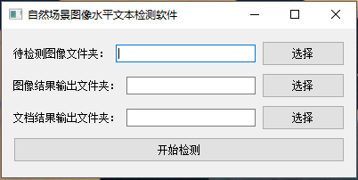

# Horizontal-Scene-Text-Detetor
A Horizontal Scene Text Detector software based on CNN

## Prerequisites
* Anaconda3
* PyTorch >= 0.4.0
* PyQT5

## How to use it
* **Download model file from [BaiduNetDisk](https://pan.baidu.com/s/1zSCXXsky98t_qBrQRK1cpQ), password: 8p6u**
* Put the model file into `model` folder;
* Put images into img folder;
* Run `main.py` file;
* When the Detection complete, there will be two new folders:
    - `result_img` folder keeps the images which marked by bounding box;
    - `result_txt` folder keeps some txt files which contains coordinates of each bounding box in each image.

## File Description
* `examples`: store some examples;
* `img`: a folder which keeps original images;
* `model`: contains a PyTorch model;
* `config.py`: some configuration of the project;
* `dataset.py & datautils.py`: process image data;
* `main.py`: main file;
* `detect.py`: detection entry;
* `model.py & resnet.py`: define the model;
* `utils.py`: some helper functions.

---

# Horizontal-Scene-Text-Detetor
一个基于CNN的水平场景文本定位软件

## 依赖
* Anaconda3
* PyTorch >= 0.4.0
* PyQT5

## 使用方式
* **从[百度网盘](https://pan.baidu.com/s/1zSCXXsky98t_qBrQRK1cpQ)下载模型文件, 提取码：8p6u**
* 将模型文件放入`model`文件夹；
* 将需要检测的图像放入img文件夹;
* 运行`main.py`文件;
* 检测完成后，会得到两个新的文件夹:
    - `result_img`文件夹保存标有包围框的图像;
    - `result_txt`文件夹保存每个图像中文本包围框所在的坐标。

## 文件描述
* `examples`: 保存部分示例结果;
* `img`: 保存待检测图像的文件夹;
* `model`: 保存PyTorch模型;
* `config.py`: 项目的一些参数设置;
* `dataset.py & datautils.py`: 处理图像数据;
* `main.py`: 主文件;
* `detect.py`: 检测入口;
* `model.py & resnet.py`: 模型定义;
* `utils.py`: 一些辅助函数。

---

# Examples 例子

---
# To-do
- [ ] Update the UI (just a demo right now)
- [ ] Upload training program later
